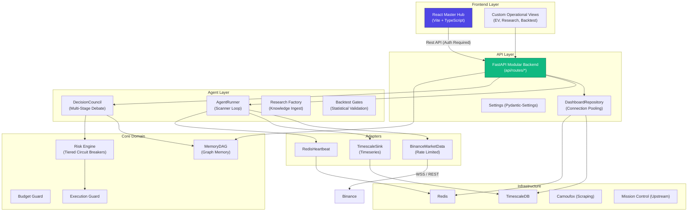

# 🏗️ CryptoSwarms — Architecture Overview

This document outlines the core architectural components, data flows, and decision-making logic of the CryptoSwarms autonomous trading system.

## High-Level System Architecture

## Core Modules

### 1. Decision Science (EV Foundation)
The system uses an Expected Value (EV) driven decision framework:
- **EV Calculator**: Estimates the probabilistic outcome of trades.
- **Kelly Criterion**: Determines optimal position sizing based on edge and risk.
- **Bayesian Updater**: Refines belief priors as new signals or data points arrive.
- **Calibration Tracker**: Measures the accuracy of "conviction" scores against realized win rates (Brier Score).

### 2. Market Intelligence (Crypto Layer)
Specialized adapters for market dynamics:
- **Liquidation Maps**: Visualizes liquidity clusters and potential cascade zones.
- **Funding Analyzer**: Calculates the cost of carry/yield for perpetual positions.
- **On-Chain Signals**: Aggregates whale movements, CVD, and Open Interest.

### 3. Execution & Risk Control
Multiple layers of defense:
- **Budget Guard**: Enforces hourly/daily spending limits on LLM and operational costs.
- **Risk Engine**: Monitors portfolio heat, daily drawdown, and symbol concentration.
- **Execution Guard**: A "Deadman's Switch" that prevents trading if heartbeat or risk telemetry is stale.

## Data Flow

1.  **Ingest**: `AgentRunner` polls Binance via `BinanceMarketData` and scrapes sources via `Camoufox`.
2.  **Persistence**: Signals, risk events, and costs are piped to `TimescaleDB` via `TimescaleSink`.
3.  **Reflection**: `DashboardRepository` provides optimized query access for the API.
4.  **Reaction**: `DecisionCouncil` queries `MemoryDAG` and `Risk Engine` to validate or reject trade hypotheses.
5.  **Visualization**: The `React Dashboard` polls the API to provide real-time quantitative intelligence.

## Decision Lifecycle

1.  **Hypothesis**: A scanner detects a pattern (e.g., Volatility Breakout).
2.  **Enrichment**: `Research Factory` adds context (On-chain signals, funding rates).
3.  **Validation**: `Backtest Gates` run Monte Carlo simulations to ensure the alpha is not luck.
4.  **Decision**: `DecisionCouncil` debates the trade; `Governor` applies the final gate.
5.  **Execution**: `Execution Guard` checks final risk telemetry before hitting the exchange.
